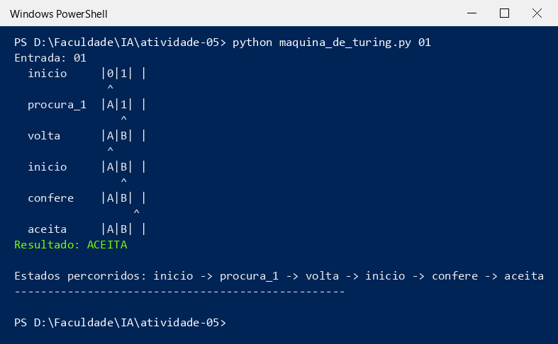
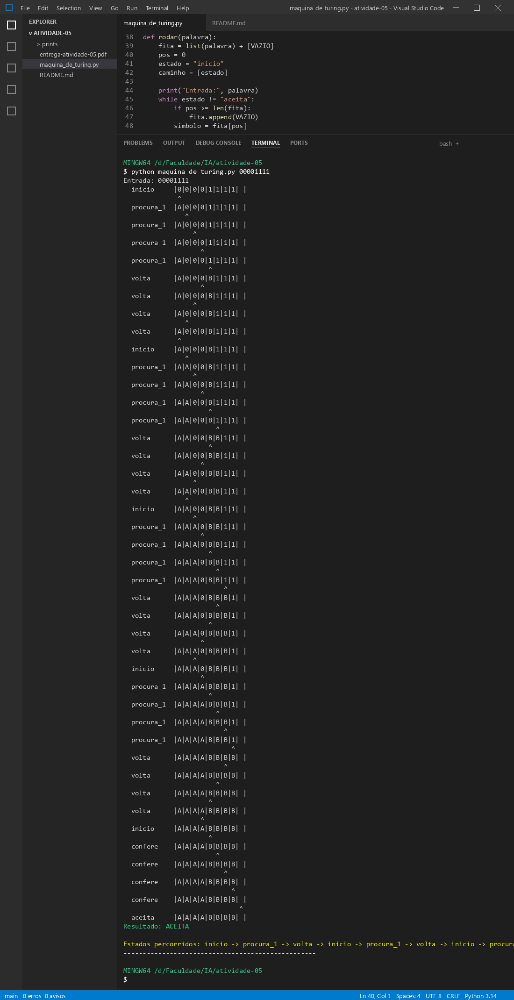
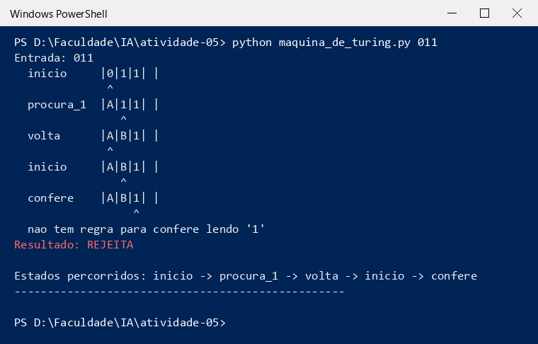

# 📝 Atividade 5 — Máquinas de Turing

> Atividade remota da aula 09 (vale 1,0 ponto). O material era o vídeo
> **Akitando #86 — O Computador de Turing e Von Neumann**. Assisti, anotei
> o que achei importante e depois fiz a máquina que reconhece `0ⁿ1ⁿ`.

📄 Código: [`maquina_de_turing.py`](maquina_de_turing.py)
🖼️ Prints: pasta [`prints`](prints)
📎 PDF que eu entreguei: [`entrega-atividade-05.pdf`](entrega-atividade-05.pdf)
📖 Resumo da aula: [aula 09 — Máquinas de Turing](../../aula-09-maquinas-de-turing.md)

---

## ✍️ Etapa 1 — Introdução

### 1. O que é uma Máquina de Turing?

É um "computador de mentirinha" que o Alan Turing inventou no papel, em 1936.
Ela tem uma fita comprida (infinita) dividida em quadradinhos, uma cabeça que
lê e escreve um símbolo de cada vez, e uma lista de regras que fala o que ela
tem que fazer em cada situação.

Mesmo sendo simples assim, ela consegue fazer qualquer conta ou algoritmo que
um computador de verdade faz. Por isso ela é usada pra definir o que é
"computar".

### 2. Quais são os principais componentes de uma Máquina de Turing?

| Componente | Pra que serve |
|:--|:--|
| **Fita** | onde fica a palavra de entrada e onde a máquina vai anotando as coisas |
| **Cabeça de leitura/escrita** | lê o quadradinho em que está, escreve outro símbolo e anda 1 casa pra esquerda ou direita |
| **Estados** | a "situação" em que a máquina está (ex.: procurando um 1, voltando...) |
| **Alfabeto** | os símbolos que podem aparecer na fita |
| **Regras de transição** | "se estou no estado X e li o símbolo Y, escrevo Z, ando pra tal lado e vou pro estado W" |

### 3. Qual é a importância das Máquinas de Turing para a computação?

Antes dela ninguém tinha uma definição certinha do que é um algoritmo. Com a
máquina deu pra provar o que um computador **consegue** e o que ele **nunca vai
conseguir** fazer.

E ela é a ideia por trás do computador moderno: o Von Neumann usou ela pra
montar a arquitetura em que o programa e os dados ficam juntos na memória, que
é como todo computador funciona até hoje. Quando falam que uma linguagem é
"Turing completa" (Python, Java...), quer dizer que ela faz tudo que uma
Máquina de Turing faz.

### 4. Qual é a relação entre Máquina de Turing e algoritmo?

Algoritmo é uma receita de passos pra resolver um problema. A Máquina de
Turing é o jeito "oficial" de escrever essa receita: cada regra da tabela é um
passo.

A ideia (chamada tese de Church-Turing) é que **se dá pra resolver com
algoritmo, dá pra resolver com uma Máquina de Turing**. E o contrário também:
se nenhuma Máquina de Turing resolve, não tem algoritmo que resolva.

---

## ✍️ Etapa 2 — Simulação

### Enunciado

```
Criar uma máquina que reconheça palavras da forma 0ⁿ1ⁿ.
Aceitas: 01, 0011, 000111, 00001111
Rejeitadas: 0, 1, 001, 011, 00111
```

### Como eu pensei

A máquina não tem variável pra guardar "quantos 0 eu vi". Então eu fiz ela
**marcar** os símbolos, igual quando a gente risca item de uma lista:

- troco um `0` por **A**
- vou até o primeiro `1` e troco por **B**
- volto pro começo e repito

Se no final só sobrar A e B, a quantidade de 0 e de 1 era igual. 😄

Exemplo com `0011`:

```
0 0 1 1    começo
A 0 B 1    marquei o 1º par
A A B B    marquei o 2º par
           não sobrou nada sem marcar → ACEITA
```

### Estados que eu usei

| Estado | O que ele faz |
|:--|:--|
| `inicio` | procura o próximo 0 pra marcar |
| `procura_1` | anda pra direita até achar o primeiro 1 |
| `volta` | volta pra esquerda até achar o A |
| `confere` | acabaram os 0, então confere se só tem B até o fim |
| `aceita` | deu certo! |

### Tabela de regras

| Estado | Lê | Escreve | Anda | Vai para |
|:--|:--:|:--:|:--:|:--|
| inicio | 0 | A | → | procura_1 |
| inicio | B | B | → | confere |
| procura_1 | 0 | 0 | → | procura_1 |
| procura_1 | B | B | → | procura_1 |
| procura_1 | 1 | B | ← | volta |
| volta | 0 | 0 | ← | volta |
| volta | B | B | ← | volta |
| volta | A | A | → | inicio |
| confere | B | B | → | confere |
| confere | (vazio) | (vazio) | → | aceita |

> 💡 Se a máquina cair numa situação que não está na tabela, ela para e
> **rejeita**. Ex.: `confere` lendo `1` quer dizer que sobrou 1 sem par.

---

## ✍️ Etapa 3 — Registro da simulação

| Teste | Entrada | Esperado | Obtido | Estados percorridos |
|:--:|:--|:--:|:--:|:--|
| 1 | `01` | ACEITA | ✅ ACEITA | inicio → procura_1 → volta → inicio → confere → aceita |
| 2 | `00001111` | ACEITA | ✅ ACEITA | inicio → procura_1 → volta (4 vezes) → inicio → confere → aceita |
| 3 | `011` | REJEITA | ❌ REJEITA | inicio → procura_1 → volta → inicio → confere (parou lendo 1) |

No teste 2 o caminho completo é `inicio → procura_1 → volta` repetido **4
vezes** (uma pra cada par), depois `inicio → confere → aceita`.

### 🖼️ Teste 1 — `01`



O menor caso. Marca o 0, marca o 1, volta, e o `inicio` já encontra B, então
vai pro `confere`, acha o vazio e aceita.

### 🖼️ Teste 2 — `00001111`



Aqui a máquina dá 4 voltas inteiras. Deu pra ver que ela anda bastante: cada
volta ela vai e volta pela fita toda.

### 🖼️ Teste 3 — `011`



Marcou o único 0 e o primeiro 1. Quando foi conferir, ainda tinha um `1`
sobrando. Não tem regra pra `confere` lendo `1`, então ela rejeitou. Era isso
mesmo que tinha que acontecer.

> ✔️ Também rodei os outros exemplos do enunciado (`0011`, `000111`, `0`, `1`,
> `001`, `00111`) e todos deram o resultado esperado.

### Descrição da Máquina de Turing criada

A minha máquina reconhece `0ⁿ1ⁿ` marcando um 0 e um 1 de cada vez. No estado
`inicio` ela troca o primeiro 0 por A e vai pro `procura_1`, que anda pra
direita até achar um 1 e troca ele por B. Depois o estado `volta` leva a
cabeça de volta até o A e tudo recomeça. Quando o `inicio` acha um B no lugar
de um 0, é porque os 0 acabaram, e aí o `confere` olha se até o fim da fita só
tem B. Se tiver, aceita. Se sobrar algum 0 ou 1 sem par, não tem regra e ela
rejeita.

---

## 🤔 Etapa 4 — Reflexão sobre os limites computacionais

**Uma Máquina de Turing consegue resolver qualquer problema?**

Não. Ela resolve tudo que tem algoritmo, mas existem problemas que não têm
algoritmo nenhum. O mais famoso é o **problema da parada**: descobrir, olhando
um programa qualquer, se ele vai terminar ou ficar rodando pra sempre. O
Turing provou que é impossível fazer um programa que responda isso certo pra
todos os casos. A ideia é que, se esse programa existisse, dava pra montar
outro que pergunta sobre ele mesmo e faz o contrário da resposta, e aí a
resposta sempre ficaria errada. Então não é questão de ter um computador mais
rápido ou com mais memória: mesmo com fita infinita, esses problemas não têm
solução.

---

## 🤔 Questão final

**Como saber se um problema é só difícil ou se não existe algoritmo pra ele?**

Um problema **difícil** tem solução, só que demora. Por exemplo, testar todas
as combinações de uma senha: é demorado, mas uma hora termina e dá a resposta
certa. Isso é assunto de complexidade de algoritmos (tempo, O(n²), O(2ⁿ)...).

Um problema **sem algoritmo** (indecidível) é outra coisa: não existe
nenhuma Máquina de Turing que pare com a resposta certa pra todas as entradas,
não importa quanto tempo eu espere.

Pra descobrir qual é o caso:

1. Se eu consigo montar uma máquina que **sempre para** com a resposta certa,
   o problema é computável (mesmo que seja lento).
2. Se resolver o meu problema também resolveria o **problema da parada**, então
   ele é indecidível, porque o da parada já foi provado impossível.

> ⚠️ Só ver que o programa "está demorando muito" não prova nada. Demora é
> sinal de problema difícil, não de problema impossível.

---

## ✅ Resumo

```
Minha máquina   marca 0 com A e 1 com B, um par por vez
Estados         inicio, procura_1, volta, confere, aceita
Testes          01 ACEITA | 00001111 ACEITA | 011 REJEITA  (os 3 bateram)
Limite          problema da parada: não existe algoritmo
Difícil x       difícil = tem algoritmo, só é lento
impossível      indecidível = não tem algoritmo nenhum
```

---

[⬅️ Voltar ao início](../../README.md)
